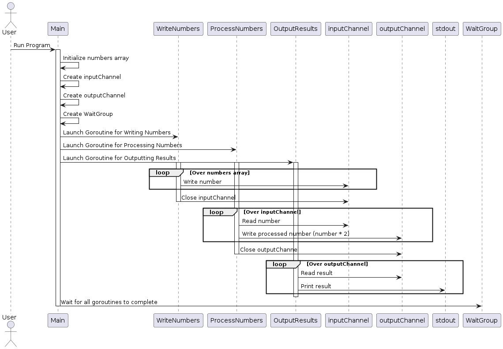

# Task 9: Number Pipeline

## Описание задачи

Разработать конвейер чисел. Даны два канала: в первый пишутся числа (x) из массива, во второй — результат операции x * 2, после чего данные из второго канала должны выводиться в stdout.

## Решение

В данном решении используются три горутины и два канала для организации конвейера чисел:
1. Первая горутина записывает числа из массива в первый канал.
2. Вторая горутина считывает числа из первого канала, умножает их на 2 и записывает результаты во второй канал.
3. Третья горутина считывает результаты из второго канала и выводит их в stdout.

