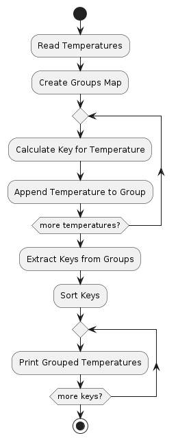

# Task 10: Group Temperature Fluctuations

## Описание задачи

Дана последовательность температурных колебаний: -25.4, -27.0, 13.0, 19.0, 15.5, 24.5, -21.0, 32.5. Объединить данные значения в группы с шагом в 10 градусов. Последовательность в подмножествах не важна.

## Решение

В программе используется map для группировки температурных значений по диапазонам с шагом в 10 градусов. Ключом карты является нижняя граница диапазона, а значением — список температур, попадающих в этот диапазон.

### Константы

- **TemperatureGroupStep**: Шаг группировки температур, равен 10.

### Алгоритм

1. **Инициализация данных**:
    - Исходный массив температур `temperatures`.

2. **Создание карты `groups`**:
    - Map, где ключом является нижняя граница диапазона, а значением — список температур, попадающих в этот диапазон.

3. **Группировка температур**:
    - Для каждой температуры вычисляется соответствующий ключ: `int(temp/TemperatureGroupStep) * TemperatureGroupStep`.
    - Температура добавляется в соответствующий список для этого ключа в карте `groups`.

4. **Сортировка и вывод**:
    - Извлекаются ключи карты и сортируются.
    - Для каждого отсортированного ключа выводится список температур, попадающих в соответствующий диапазон.

