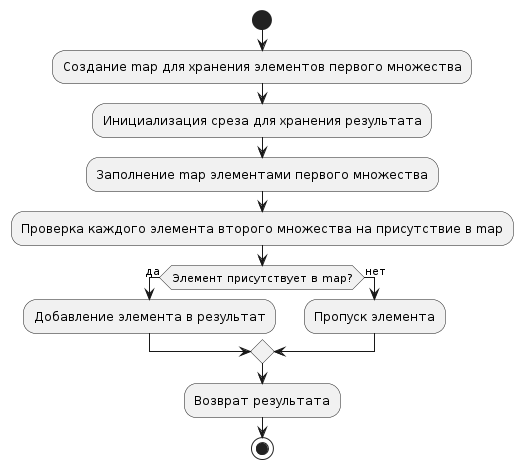

# Task 11: Intersection of Two Unordered Sets

## Описание задачи

Реализовать пересечение двух неупорядоченных множеств.

## Решение

В данном решении для нахождения пересечения двух множеств используется карта (map). Это решение эффективно благодаря следующему:

Map позволяет проверять присутствие элемента за амортизированное время O(1), что делает операцию поиска быстрой. 

Вначале создается map для хранения элементов первого множества. 
Затем каждый элемент второго множества проверяется на присутствие в map. 
Если элемент присутствует в обоих множествах, он добавляется в результат.

Такой подход также делает код читаемым и понятным.



### Пример вывода

```plaintext
INFO[0000] Множество 1: [4 7 9 2 5]
INFO[0000] Множество 2: [3 7 9 1 8]
INFO[0000] Пересечение множеств: [7 9]
```