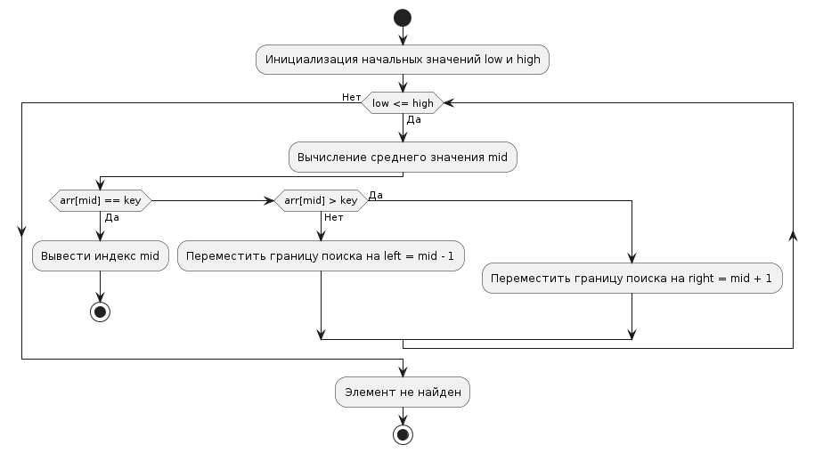

# Task 17: Binary Search Implementation

## Описание задачи

Реализовать алгоритм бинарного поиска для нахождения элемента в отсортированном массиве. Бинарный поиск значительно ускоряет поиск по сравнению с линейным, используя деление массива на половины.

## Реализация

Программа написана на Go и демонстрирует классический алгоритм бинарного поиска, который находит позицию элемента в массиве, если такой элемент существует. В качестве дополнительной особенности используется логирование для отображения результатов поиска.

### Основные компоненты

- **binarySearch(arr []int, key int) (int, bool)**: Функция принимает отсортированный массив `arr` и ключ `key`, который нужно найти. Возвращает индекс найденного элемента и булево значение, показывающее, был ли элемент найден.

### Принцип работы

Бинарный поиск начинает свою работу с определения среднего элемента отсортированного массива. В зависимости от того, больше ли ключ поиска или меньше среднего элемента, поиск продолжается в левой или правой половине массива. Процесс продолжается рекурсивно, пока не будет найден искомый элемент или пока не останется элементов для проверки.

