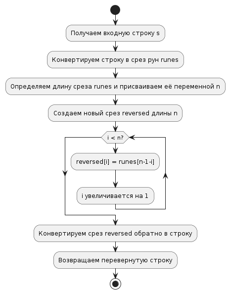

# Task 19: Reverse string

## Описание задачи

Разработать программу, которая переворачивает подаваемую на ход строку (например: «главрыба — абырвалг»). Символы могут быть unicode.

## Реализация

- Для того чтобы корректно обрабатывать unicode используются руны.
- Переворачивание строки производится в цикле.

