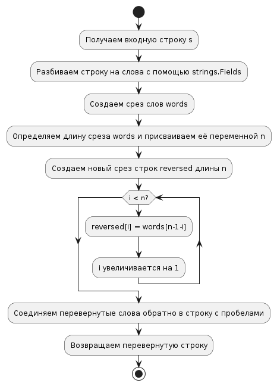

# Task 20: Reverse words in a string

## Описание задачи

Разработать программу, которая переворачивает слова в строке. Пример: «snow dog sun — sun dog snow».

## Реализация

- Для разбивки строки на слова используется функция `strings.Fields`.
- Переворачивание порядка слов производится в цикле.
- Слова соединяются обратно в строку с помощью `strings.Join`.

