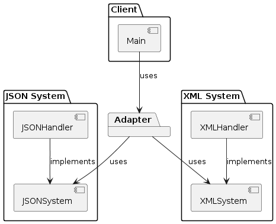

# Task 21: XML and JSON Data Adapter

## Описание задачи

Разработать программу, которая позволяет преобразовывать данные между форматами XML и JSON. Программа должна поддерживать оба направления преобразования: из JSON в XML и из XML в JSON.

## Реализация

- Использование двух интерфейсов `JSONSystem` и `XMLSystem` для абстракции операций сериализации и десериализации.
- Классы `JSONHandler` и `XMLHandler` реализуют соответствующие интерфейсы для обработки JSON и XML.
- Адаптер `Adapter` предоставляет методы `JSONToXML` и `XMLToJSON` для выполнения двунаправленных преобразований.
- Использование библиотеки `logrus` для логирования операций и ошибок.

