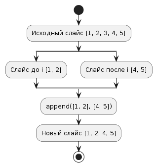
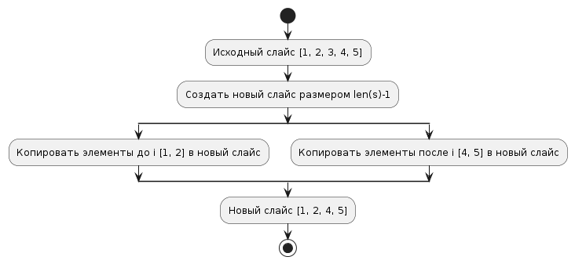
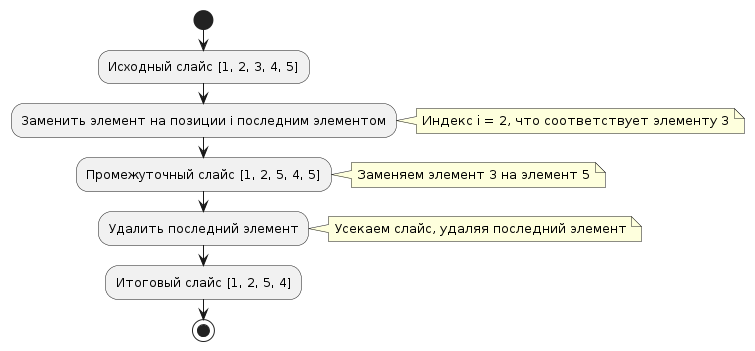

# Task 23: Removing an Element from a Slice

## Задание
Разработать несколько подходов для удаления i-го элемента из слайса в Go, учитывая различные требования к сохранению порядка элементов и неизменности исходного слайса.

## Решения

### solution1: Использование `append` для удаления элемента
Этот подход изменяет исходный слайс, используя функцию `append` для создания нового слайса без указанного элемента, сохраняя порядок оставшихся элементов.

**Преимущества:**
- Простота и читаемость кода.
- Эффективность при работе с небольшими слайсами.

**Недостатки:**
- Изменение исходного слайса, что может быть нежелательно в некоторых контекстах.

### solution2: Создание копии слайса перед удалением элемента
Этот метод гарантирует, что исходный слайс остается неизменным, создавая полную копию слайса перед удалением элемента.

**Преимущества:**
- Не изменяет исходный слайс.
- Подходит для функций, где необходимо сохранить исходные данные.

**Недостатки:**
- Больший расход памяти и времени исполнения из-за необходимости копирования элементов.

### solution3: Замена удаляемого элемента последним и усечение слайса
Метод заменяет удаляемый элемент последним в слайсе и уменьшает размер слайса, что эффективно при больших массивах данных, если порядок элементов не важен.

**Преимущества:**
- Очень быстрое удаление без дополнительных расходов на память.
- Эффективно для больших массивов.

**Недостатки:**
- Нарушение порядка элементов в слайсе.

