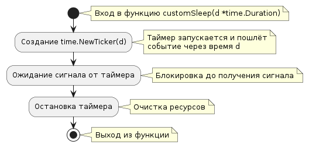

# Задача 25: Реализовать собственную функцию sleep

## Описание задачи

Разработать функцию `customSleep`, которая позволяет программе "уснуть" на указанное время без использования функции `time.Sleep` из стандартной библиотеки.

## Реализация

- Используется `time.Ticker` для ожидания без блокирования основного потока исполнения.
- Функция `customSleep` принимает аргумент `time.Duration` и использует тикер для отсчета времени.
- Когда тикер достигает указанного времени, он отправляет сигнал в канал, и функция завершает свою работу.
- Пример включает логирование времени начала и окончания сна для демонстрации работы функции.



```go
log.Infof("Начало в : %v\n", time.Now())
customSleep(10 * time.Second)
log.Infof("Окончание в: %v\n", time.Now())```
```

```bash
INFO[0000] Start at 2024-06-06 21:06:26.826195068 +0300 MSK m=+0.000040629 
INFO[0010] Finish at 2024-06-06 21:06:36.835367205 +0300 MSK m=+10.009212756
```