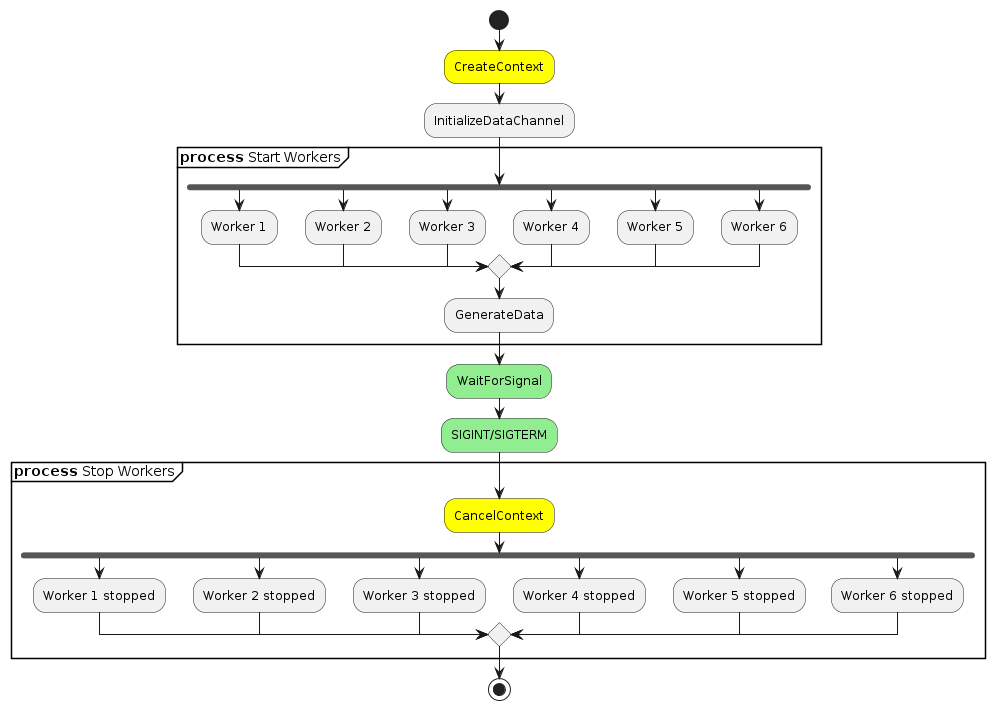
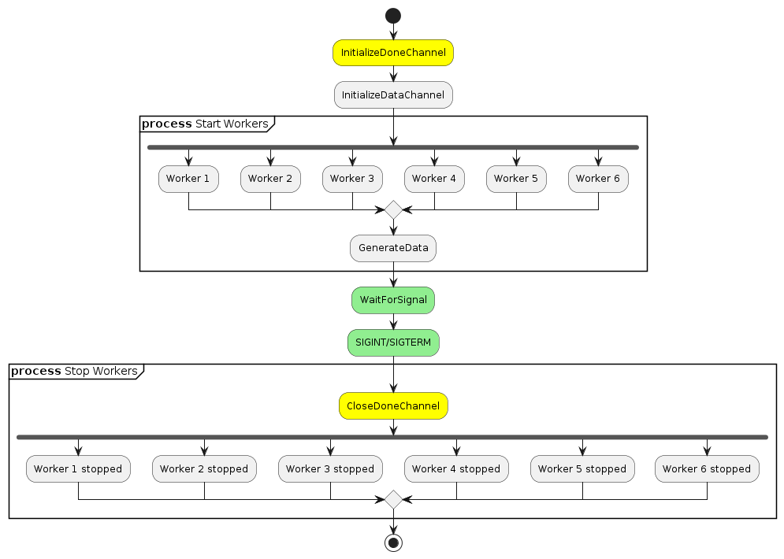

# Task 4: Data Handling with Workers

## Задание
Реализовать программу, в которой постоянно записываются данные в канал (главный поток), а набор воркеров конкурентно читают эти данные и выводят в stdout. Программа должна корректно завершаться по сигналу прерывания (Ctrl+C).

## Решения

### Solution 1: Использование контекста
Этот подход использует `context.Context` для управления сигналами завершения работы воркеров.

**Преимущества:**
- **Гибкое управление:** контекст позволяет управлять временем жизни горутин и обрабатывать сигналы завершения в любой точке выполнения.
- **Чистый код:** использование контекста делает код более структурированным и читаемым.

### Solution 2: Использование канала `done`
В данной реализации для уведомления о необходимости завершения работы используется канал `done`.

**Преимущества:**
- **Простота реализации:** использование канала `done` делает решение понятным и легко реализуемым.
- **Чёткое управление:** явное управление завершением горутин через канал.

**Недостатки:**
- **Риск утечек:** если не все горутины прослушивают канал `done`, это может привести к утечкам и не завершению горутин.

### Solution 3: Использование `sync.WaitGroup`
Этот метод использует `sync.WaitGroup` для ожидания завершения всех запущенных воркеров после закрытия канала данных.

**Преимущества:**
- **Надёжное завершение:** `WaitGroup` гарантирует, что главный поток будет ждать завершения всех воркеров.
- **Эффективное управление ресурсами:** позволяет избежать зависания или недостаточной синхронизации при завершении программы.

**Недостатки:**
- **Комплексность:** управление `WaitGroup` требует внимательности, особенно в системах с большим количеством горутин.

